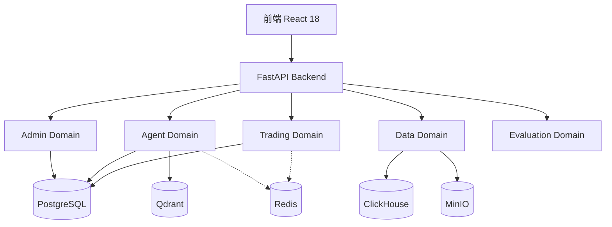

## 快速开始

### 安装依赖

::: code-group

```bash [快速启动]
# 1. 启动所有数据库
./scripts/start-full.sh

# 2. 初始化数据库
cd backend
poetry install
poetry run python ../scripts/init_database.py

# 3. 启动后端
poetry run python -m uteki.main

# 4. 启动前端
cd frontend
pnpm install && pnpm dev
```

```bash [验证系统]
# 运行完整性验证
./scripts/verify_system.sh

# 访问API文档
open http://localhost:8000/docs

# 访问前端
open http://localhost:5173
```

:::

### 配置API密钥

访问 `http://localhost:8000/docs`，在 `/api/admin/api-keys` 端点添加：

- **交易所**: OKX、Binance、Interactive Brokers
- **LLM**: OpenAI、Claude、DeepSeek、Qwen
- **数据源**: FMP (Financial Modeling Prep)

### 创建你的第一个Agent

```python
from uteki.domains.agent.core.base_agent import BaseAgent

class MyTradingAgent(BaseAgent):
    def __init__(self):
        super().__init__(
            name="my_trading_agent",
            llm_provider="openai",
            model="gpt-4",
            tools=["get_market_data", "execute_order"]
        )

    def get_system_prompt(self) -> str:
        return "你是一个专业的交易Agent..."

    async def execute(self, task: str, context: dict):
        # 实现交易逻辑
        market_data = await self.use_tool("get_market_data", symbol="BTC-USDT")
        # ...
        return result
```

## 系统架构



## 为什么选择 uteki.open？

### 🎯 面向个人交易者

不同于机构级平台的复杂性，uteki.open专为个人交易者设计：

- ✅ 本地部署，数据隐私
- ✅ 无需注册，开箱即用
- ✅ API密钥加密存储
- ✅ 完整的文档和示例

### 🤖 AI原生设计

从零开始为AI Agent设计的架构：

- 统一的Agent框架
- 灵活的工具系统
- 语义记忆检索 (Qdrant)
- 多Agent协作编排

### 📈 企业级能力

虽然面向个人，但具备企业级能力：

- 时序数据库 (ClickHouse) 支持大规模回测
- 完整的评估体系 (OpenAI Evals)
- 审计日志和风险控制
- 高可用降级策略

### 🛠️ 开发者友好

清晰的架构和完善的文档：

- DDD领域驱动设计
- 类型安全 (SQLAlchemy 2.0 + Pydantic 2.0)
- 完整的API文档
- 端到端测试覆盖

## 社区支持

- 📖 [完整文档](https://docs.uteki.open)
- 💬 [GitHub Discussions](https://github.com/yourusername/uteki.open/discussions)
- 🐛 [问题反馈](https://github.com/yourusername/uteki.open/issues)
- 🌟 [Star on GitHub](https://github.com/yourusername/uteki.open)

## 许可证

MIT License - 完全开源，商业友好
